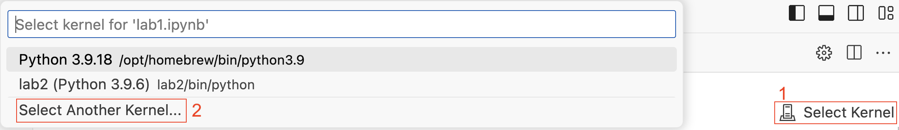
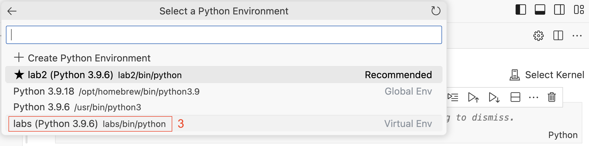

# Kako postaviti virtualno okruženje u Visual Studio Code-u za Jupyter notebook

Kao data scientist ili softverski inženjer, vjerojatno ste upoznati s Jupyter bilježnicama, popularnim alatom za stvaranje i dijeljenje interaktivnih vizualizacija podataka i modela strojnog učenja. Jedna od prednosti korištenja Jupyter bilježnica je mogućnost stvaranja i prebacivanja između virtualnih okruženja, koja vam omogućavaju izolaciju vašeg Python okruženja za svaki projekt. Međutim, ako koristite Jupyter bilježnice u Visual Studio Code (VS Code), možda ste primijetili da on ne koristi uvijek aktivno virtualno okruženje. U ovom članku istražit ćemo kako postaviti virtualna okruženja u VS Code za Jupyter bilježnice kako bismo osigurali da koristite ispravno okruženje za vaš projekt.

## Što je virtualno okruženje?

Prije nego što zaronimo u specifičnosti postavljanja virtualnih okruženja u VS Code, prvo definirajmo što je virtualno okruženje i zašto je važno. Virtualno okruženje je samostalno Python okruženje koje vam omogućuje instalaciju paketa i ovisnosti specifičnih za određeni projekt, bez utjecaja na globalno Python okruženje vašeg sustava. To vam omogućuje rad na više projekata s različitim ovisnostima bez brige o sukobima između paketa.

## Postavljanje virtualnih okruženja u VS Code

VS Code ima ugrađenu podršku za virtualna okruženja, što olakšava stvaranje i prebacivanje između okruženja. Evo kako postaviti virtualna okruženja u VS Code za Jupyter bilježnice:

### Korak 1: Instalirajte Python proširenje

Prvi korak je instalacija Python proširenja za VS Code, koje pruža podršku za Python razvoj u VS Code. Za instalaciju proširenja slijedite ove korake:

1.  Otvorite VS Code
2.  Kliknite na ikonu Proširenja u bočnom izborniku (ili pritisnite `Ctrl+Shift+X` na Windowsu ili `Cmd+Shift+X` na Macu)
3.  Pretražite `Python` u traci za pretragu
4.  Kliknite `Instaliraj` pored `Python` proširenja

### Korak 2: Stvorite virtualno okruženje

Jednom kada ste instalirali Python proširenje, možete stvoriti virtualno okruženje za vaš projekt. Za stvaranje virtualnog okruženja slijedite ove korake:

1.  Otvorite VS Code
2.  Kliknite na izbornik `Terminal` u gornjoj traci izbornika i odaberite `Novi terminal`
3.  U terminalu, navigirajte do direktorija gdje želite stvoriti virtualno okruženje
4.  Utipkajte sljedeću naredbu za stvaranje novog virtualnog okruženja: `python -m venv <ime_virtualnog_okruženja>`
5.  Pritisnite Enter

Na primjer, ako želite stvoriti virtualno okruženje pod nazivom `labs` u vašem početnom direktoriju, utipkali biste:

```python
python -m venv labs
```

### Korak 3: Aktivirajte virtualno okruženje

Jednom kada ste stvorili virtualno okruženje, potrebno ga je aktivirati. Za aktivaciju virtualnog okruženja slijedite ove korake:

1.  U terminalu, navigirajte do direktorija gdje ste stvorili virtualno okruženje
2.  Utipkajte sljedeću naredbu za aktivaciju virtualnog okruženja:
    -   Na Windowsu: `<ime_virtualnog_okruženja>\Scripts\activate`
    -   Na Macu/Linuxu: `source <ime_virtualnog_okruženja>/bin/activate`

Na primjer, ako ste stvorili virtualno okruženje pod nazivom `labs` u vašem početnom direktoriju, utipkali biste:

```python
source labs/bin/activate
```

### Korak 4: Instalirajte Jupyter bilježnicu

Sada kada ste aktivirali virtualno okruženje, možete instalirati Jupyter bilježnicu i bilo koje druge pakete koji su vam potrebni za vaš projekt. Za instalaciju Jupyter bilježnice slijedite ove korake:

1.  U terminalu, provjerite je li vaše virtualno okruženje aktivirano (ime virtualnog okruženja trebalo bi se pojaviti u nazivu terminala)
2.  Utipkajte sljedeću naredbu za instalaciju Jupyter bilježnice: `pip install jupyter`
3. Utipkajte sljedeću naredbu za instalaciju `ipykernel`-a: `pip install ipykernel`


### Korak 5: Pokrenite Jupyter bilježnicu

Jupyterovu bilježnicu možete izraditi pokretanjem naredbe `Create: New Jupyter Notebook` iz `Command Palette` (⇧⌘P na Mac-u ili Ctrl+Shift+P na Windowsu) ili stvaranjem nove `.ipynb` datoteke u vašem radnom prostoru.

Zatim odaberite kernel pomoću alata za odabir kernela u gornjem desnom kutu. U našem primjeru je kreiran `labs` virtualno okruženje koje nije dostupno u izborniku pa je potrebno označiti `Select Another Kernel`.



Nakon toga označujemo `labs` virtualno okruženje i možemo započeti rad u našoj bilježnici unutar `Visual Studio Code`-a.



