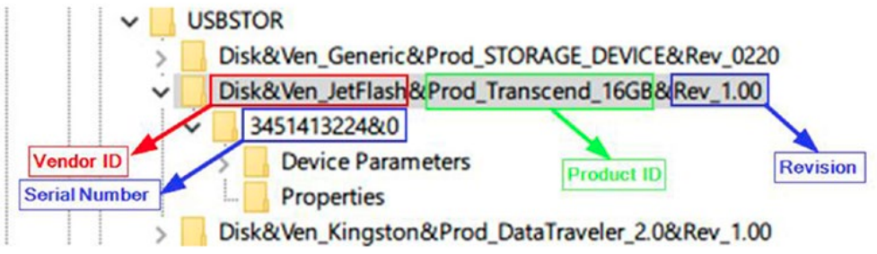

# Lab 3 - Forenzika USB uređaja

Zamislite sljedeći scenarij: sutradan imate kolokvij iz iznimno kompliciranog kolegija Računalna forenzika. Problem je u tome što nitko ne zna kako će kolokvij izgledati, primjeri kolokvija prošlih godina ne postoje, a skraćene verzije verzija skripti za učenje još nitko nije pripremio.

Međutim, saznalo se da je profesor pripremio kolokvij te ga drži spremljenog na svom računalu. U trenutku neopreznosti profesor, koji ostaje kasno na fakultetu zbog rokova na nekom projektu, odlazi van ureda uzet kavu na aparat, ne zaključava ured, te pri povratku zatekne upaljen ekran računala na kojem se nalazi otvoren direktorij u kojem je kolokvij. Sumnja se da je kolokvij procurio...

## Zadatak 1

Zadatak forenzičara je saznati je li u trenutku neopreznosti bio spojen USB memorijski ključ spojen na računalo na kojeg je mogao biti kopiran kolokvij.

Operacijski sustav Windows 10 sadrži interni log u koji sprema listu (USB) uređaja koji su prvi put bili povezani na računalo. Ime datoteke je `setupapi.dev.log` koja se nalazi u direktoriju `\Windows\inf\`. Iz direktorija [Download](Download) sačuvajte datoteku `setupapi.dev2.log` koju je forenzičar pripremio za vas.

Vaš zadatak je napraviti skriptu u pythonu koja parsira navedenu log datoteku te ispisuje sve USB uređaje koji su bili prvi put povezani na računalo kao i vrijeme u kojem su se prvi put povezali na računalo. Na slici ispod možete vidjeti koji su parametri jedinstveno identificiraju uređaj. 



Na ekranu ispod možete vidjeti dio loga u kojem su parametri USB uređaja zapisani u log datoteku:

```
>>>  [Device Install (Hardware initiated) - SWD\WPDBUSENUM\_??_USBSTOR#Disk&Ven_JetFlash&Prod_Transcend_16GB&Rev_1.00#3451413224&0#{53f56307-b6bf-11d0-94f2-00a0c91efb8b}]
>>>  Section start 2021/01/19 11:29:24.146
     dvi: {Build Driver List} 11:29:24.166
```

Poznavajući način na koji se u računalo sprema datoteka, možete parsiranjem veoma brzo izvući listu svih uređaja kao i trenutak u kojem se USB bio prvi put spojen na računalo.

Ovdje je navedn primjer kostura koda
```python

import re
import datetime

# Read the contents of the setupapi.dev.log file
with open(log_path, "r") as log_file:
     # Store information about each USB device in a dictionary
     for line in log_file:
     # Find all USB device installation events and extract information about each device
```

Upotrijebite sljedeći regularni izraz da nađete sve USB uređaje - možete koristiti `re.match` finkciju:

```python
r'^>>>  \[Device Install.*#(Disk&Ven_[A-Za-z0-9]+)&(Prod_([\w\s\S]+?))&(Rev_([\w\s\S]+?))#([\w\s\S]+?)#.*\]'
```

Nakon toga, pohranite informaciju u rječnik 
`usb_devices = {}`. U rječnik pohranite informaciju o tome koji je `device_vendor_id`, `device_product_id`, `device_instance_id`, `serial_number` te `event_time`. Uzmite u obzir da USB uređaj može biti više puta ubačen u računalo.

Napomena: za čitanje sljedeće linije u kodu koristite `next(log_file)` naredbu. Ovo će vam pomoći za `event_time` vrijeme kada je USB bio spojen na računalo.


## Zadatak 2

Nakon toga, sa [OneDrive-a](https://fesb-my.sharepoint.com/:u:/g/personal/toperkov_fesb_hr/EfhiVmgtjjVFuTtYW8Ga8rcB7nb6RzY22WMw4XfQ1jrewg?e=ewLmrz) skinite sigurnosnu kopiju USB-a te je otvorite u _Read-only modu_ korištenjem [Arsenal Image Mounter](https://www.softpedia.com/get/CD-DVD-Tools/Virtual-CD-DVD-Rom/Arsenal-Image-Mounter.shtml). Kada stisnete tipku `Mount Image`, pronađite sigurnosnu kopiju diska, označite `Read only` te `Create "removable" disk device`. Korištenjem koda iz prethodne vježbe za svaku datoteku na USB-u izračunajte `file_names`, `extensions`, `md5s`, `sha1s`, `sha256s`, `magic_numbers` te `extension_matches`, redom.

Nastavno na nju, ažurirajte kod tako da računa i vrijeme kada je datoteka nastala, kada je izmjenjena te kada joj se pristupilo. U gornjem kodu prvo stvorite tri prazne liste `creation_times`, `modification_times` i `access_times` za pohranjivanje vremenskih oznaka metapodataka datoteke. Zatim, za svaku datoteku izdvajamo vrijeme stvaranja, vrijeme izmjene i vrijeme pristupa pomoću funkcija `os.path.getctime()`, `os.path.getmtime()` i `os.path.getatime()`. Svaku vremensku oznaku pretvaramo u format čitljiv ljudima pomoću funkcije `time.ctime()` i dodajemo ih na odgovarajuće popise.

Usporedite vremena kada je zadnji put neki USB ubačen u računalo u `setupapi.dev.log` datoteci sa vremenom kada je neka datoteka prebačena na USB te zaključite o kojem se USB-u radi.